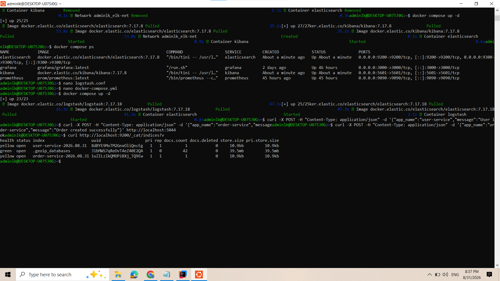

1. Phân Loại Log Theo Index Động Trên Elasticsearch Trong Logstash

Bước 1: Cấu hình logstash.conf và docker-compose.yml

File logstash.conf:
input {
  http {
    port => 5044
    codec => json
  }
}

output {
  elasticsearch {
    hosts => ["http://elasticsearch:9200"]
    index => "%{[app_name]}-%{+YYYY.MM.dd}"
  }
  stdout { 
    codec => rubydebug 
  }
}

File docker-compose.yml:
version: '3.8'

services:
  elasticsearch:
    image: docker.elastic.co/elasticsearch/elasticsearch:7.17.18
    container_name: elasticsearch
    environment:
      - discovery.type=single-node
      - ES_JAVA_OPTS=-Xms512m -Xmx512m
    ports:
      - "9200:9200"
    networks:
      - elk-net

  logstash:
    image: docker.elastic.co/logstash/logstash:7.17.18
    container_name: logstash
    volumes:
      - ./logstash.conf:/usr/share/logstash/pipeline/logstash.conf:ro
    ports:
      - "5044:5044"
    depends_on:
      - elasticsearch
    networks:
      - elk-net

networks:
  elk-net:
    driver: bridge

Bước 2: Khởi chạy môi trường và đẩy log test của từng service

Lệnh khởi chạy:
docker compose up -d

Gửi log giả lập cho user-service:
curl -X POST -H "Content-Type: application/json" -d '{"app_name":"user-service","message":"User logged in successfully"}' http://localhost:5044

Gửi log giả lập cho order-service:
curl -X POST -H "Content-Type: application/json" -d '{"app_name":"order-service","message":"Order created successfully"}' http://localhost:5044

Bước 3: Kiểm tra danh sách Index bằng Elasticsearch API

curl http://localhost:9200/_cat/indices?v

### 🖼️ Ảnh 1: Kết quả kiểm tra _cat/indices cho thấy Logstash đã tự động phân loại log vào 2 index user-service và order-service riêng biệt

2. Giải Thích Lý Thuyết & Đáp Án

Nguyên nhân gây việc dồn chung log vào một index duy nhất:
- Cấu hình cũ `index => "logstash-%{+YYYY.MM.dd}"` sử dụng chuỗi cố định `logstash-`, khiến toàn bộ log từ tất cả các microservices (user-service, order-service, payment-service,...) khi đổ về Logstash đều bị đẩy chung vào cùng một index theo ngày. Điều này làm tăng kích thước index, khó khăn khi phân quyền truy cập (RBAC) và giảm hiệu năng tìm kiếm trên Kibana.

Lợi ích của việc phân loại Index động bằng %{[app_name]}-%{+YYYY.MM.dd}:
- Cấu hình `%{[app_name]}` giúp Logstash trích xuất giá trị trường `app_name` trong dữ liệu JSON nhận được để làm tiền tố cho tên Index.
- Log được cô lập hoàn toàn theo từng microservice (`user-service-YYYY.MM.dd`, `order-service-YYYY.MM.dd`), giúp quản trị viên dễ dàng quản lý chu kỳ lưu trữ (ILM - Index Lifecycle Management), phân quyền tìm kiếm và tối ưu tốc độ truy vấn trên Kibana.
